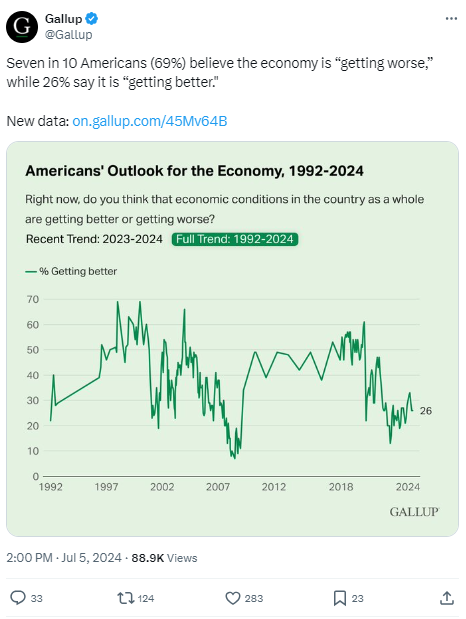
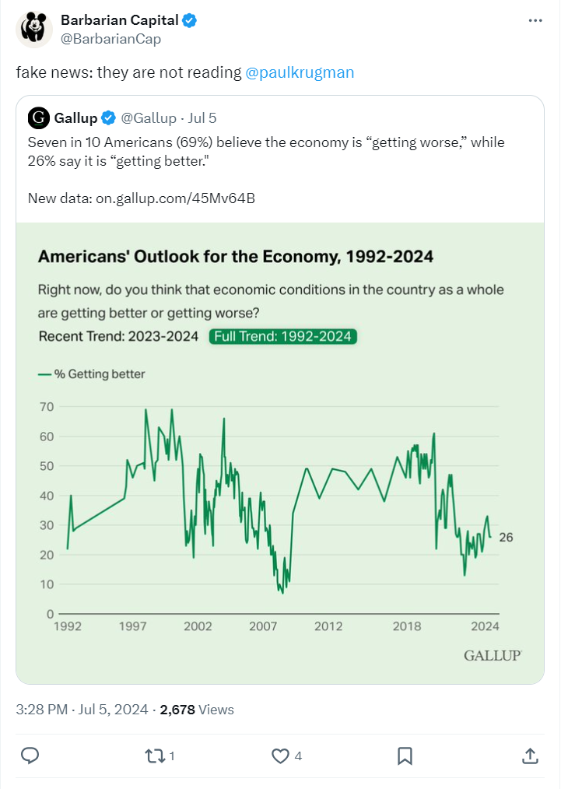
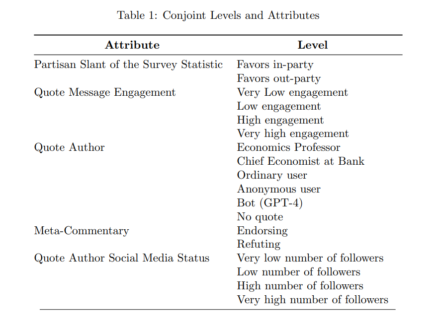

```{r setup, include=FALSE}
library(xaringanthemer)
library(kableExtra)
library(xaringan)
library(xaringanExtra)

style_duo_accent(primary_color = "#001A57",
                 secondary_color = "#708090",
                 text_font_family = "Droid Serif",
                 text_font_url = "https://fonts.googleapis.com/css?family=Droid+Serif:400,700,400italic",
                 header_font_google = google_font("Yanone Kaffeesatz"),
                 text_slide_number_color = "#000000")
knitr::opts_chunk$set(echo = FALSE)
options("kableExtra.html.bsTable" = T)

htmltools::tagList(
  xaringanExtra::use_clipboard(
    button_text = "<i class=\"fa fa-clipboard\"></i>",
    success_text = "<i class=\"fa fa-check\" style=\"color: #90BE6D\"></i>",
    error_text = "<i class=\"fa fa-times-circle\" style=\"color: #F94144\"></i>"
  ),
  rmarkdown::html_dependency_font_awesome()
)
use_xaringan_extra(c("tile_view", "animate_css", "tachyons"))
use_scribble()
use_extra_styles(
  hover_code_line = TRUE,         
  mute_unhighlighted_code = TRUE
  )  

```


## Survey Statistics in Social Media

.pull-left[
```{r, out.width = "300px"}

```
]

---

## Survey Statistics in Social Media

.pull-left[
```{r, out.width = "300px"}

```
]

--

.pull-right[
```{r, out.width = "200px"}

```

```{r, out.width = "200px"}

```

]

---

## Hypotheses and Research Questions (1)

- **H1:** Individuals who receive a social media post endorsed (or refuted) by another user will perceive the survey statistic in the original post as more (or less) credible than those who receive the original post without commentary.

--

- **RQ1:** How does the perceived credibility of a survey statistic vary depending on the expertise of the source endorsing or refuting it, such as ordinary users, AI-generated accounts, or experts?

--

- **H2:** Endorsing or refuting posts with high engagement will have a greater effect on perceived
credibility than those with low engagement.

--

- **H3:** Endorsing or refuting posts from users with high social media status will have a greater
effect on perceived credibility than those from users with low social media status.

---

## Hypotheses and Research Questions (2)

- **RQ2:** How does the interaction between a post’s engagement and the expertise of the source quoting a survey statistic affect its credibility?

--

- **RQ3:** How does the interaction between the social media status and expertise of the source quoting a survey statistic affect its credibility?

--

- **RQ4:** Is the effect of a source’s popularity and expertise on the credibility of a quoted survey statistic conditional on whether the message’s implications favor or oppose the recipient’s interests or party affiliation?

---

## Research Design

.center[
```{r, out.width = "650px"}

```
]


---

## Research Design

.pull-left[
```{r, out.width = "500px"}

```
]

.pull-right[
```{r, out.width = "1000px"}

```
]


