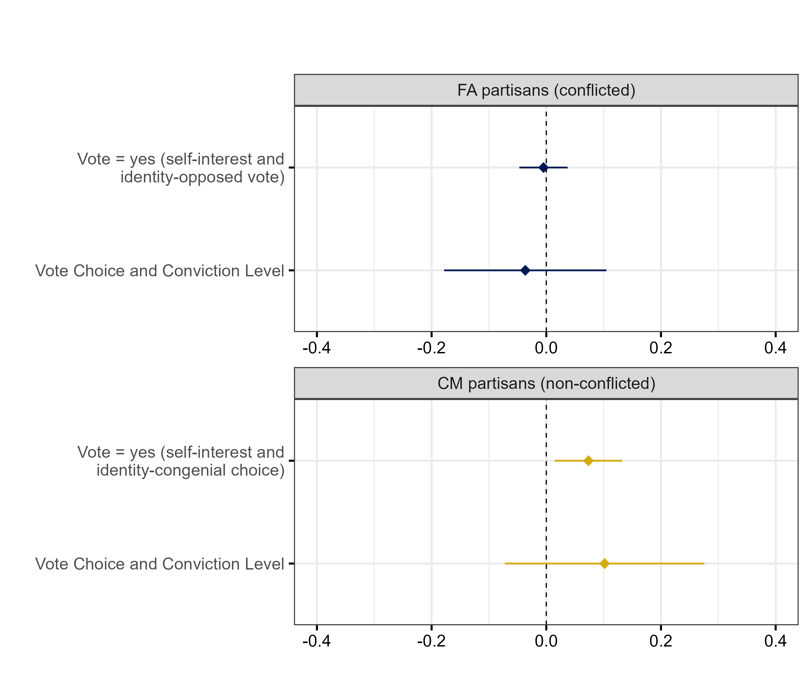

```{r setup, include=FALSE}
library(xaringanthemer)
library(kableExtra)
library(xaringan)
library(xaringanExtra)

style_duo_accent(primary_color = "#001A57",
                 secondary_color = "#708090",
                 text_font_family = "Droid Serif",
                 text_font_url = "https://fonts.googleapis.com/css?family=Droid+Serif:400,700,400italic",
                 header_font_google = google_font("Yanone Kaffeesatz"),
                 text_slide_number_color = "#000000")
knitr::opts_chunk$set(echo = FALSE)
options("kableExtra.html.bsTable" = T)

htmltools::tagList(
  xaringanExtra::use_clipboard(
    button_text = "<i class=\"fa fa-clipboard\"></i>",
    success_text = "<i class=\"fa fa-check\" style=\"color: #90BE6D\"></i>",
    error_text = "<i class=\"fa fa-times-circle\" style=\"color: #F94144\"></i>"
  ),
  rmarkdown::html_dependency_font_awesome()
)
use_xaringan_extra(c("tile_view", "animate_css", "tachyons"))
use_scribble()
use_extra_styles(
  hover_code_line = TRUE,         
  mute_unhighlighted_code = TRUE
  )  

```


## Rational Choice Voting Models

--

### Under what circumstances is it rational for an individual to vote?

--

### In those circumstances, how will a rational individual cast their vote?
 
--

**Instrumental Strand:** $\large \;\;\;\;\;\;\;\; R = pB - c$

--

**Expressive Strand:** $\large \;\;\;\;\;\;\;\;\;\;\; R = pB - c + \delta$

- $\delta$ represents ‘citizen duty' <span class="cita">(Riker and Ordeshook, 1968)</span>

---

## Rational Choice Vote Choice Models

$$EU_{i}(a) = \underbrace{pB_{i}(a)}_{\text{Instrumental}} + \underbrace{\delta_{i}(a)}_{\text{Expressive}}$$


--

- Brennan and Lomasky (1997) famously argue that voters derive **expressive utility** or intrinsic benefits from voting a particular way. 

  - Preferences reveal to others what kind of person we are, and we benefit from expressing ourselves in particular ways.
  
  - This is relevant even in contexts as voting where the revelation of the preference is private, individuals also express to themselves <span class="cita">(Brennan and Lomasky, 1997)</span>.

--

- $\delta$ can be a moral choice <span class="cita">(Harrod, 1936)</span>, confirming one's identity <span class="cita">(Hillman, 2010)</span>, altruism and genorisity <span class="cita">(Andreoni and Miller, 2002)</span>, self-image concerns <span class="cita">(Tullock, 1971)</span> or even social pressure <span class="cita">(Gerber, 2008)</span>. 
---

## The Role of Decisiveness

$$EU_{i}(a) = \underbrace{\color{purple}{p}B_{i}(a)}_{\text{Instrumental}} + \underbrace{\delta_{i}(a)}_{\text{Expressive}}$$

--

- **Key prediction:** when decisiveness or pivotality $\color{purple}{p}$ is  low, expressive concerns should dominate; however, as decisiveness increases self-interest should become more prominent.

--

- The probability of being the pivotal voter in large-scale elections is extremelly **small**. An estimate for 2008 U.S. presidential election was an average of 1 in 60 million <span class="cita">(Gelman, Silver, and Edlin, 2012)</span>.

--

.space[> .cite['It is misleading to describe electoral "choice" as a choice between $a$ and $b$: It is, rather, a choice between expressing a preference for $a$ and expressing a preference for $b$']  <br> <span class="cita">(Brennan and Lomasky, 1997)</span>]

---

## Low-Cost Theory of Voting

$$EU_{i}(a) = \underbrace{\color{purple}{p}B_{i}(a)}_{\text{Instrumental}} + \underbrace{\delta_{i}(a)}_{\text{Expressive}}$$

- **Main critique:** Expressive rational choice models cannot be tested empirically <span class="cita">(Green and Shapiro, 1995)</span>.

  - We just can observe votes or measure preferences, but cannot measure each component of the utility function.

--

- However, the **low-cost theory of voting** can be tested <span class="cita">(Tyran and Wagner, 2016)</span>.

  - The core of this theory is that voters trade off instrumental and expressive motives, and that the way they weigh them depends on pivotality. 
  
  - This is testable when self-interest and expressive motivations diverge, which is also the substantively interest case.

---

## Previous Research

- Laboratory experiments mostly focused on redistribution ('fair' outcome vs financial gain, randomizing pivotality).  

- The evidence is mixed:

  - Support for the low-cost theory of voting <span class="cita">(Bischoff & Egbert, 2013; Feddersen, Gailmard and Sandroni, 2009; Shayo and Harel, 2012)</span>.
  
  - No evidence of effect of decisiveness in voting decisions <span class="cita">(Carter and Guerette, 1992; Tyran, 2004; Kamenica and Brad, 2014)</span>.
  
--

  
<!--   - Researchers tested the low-cost theory of voting through laboratory experiments mostly focused on redistribution.   -->

<!--    - In these experiments, the expressive component involved participants expressing a preference for a 'fair' outcome, while the instrumental component related to financial gain.  -->

<!--    - Typically, participants were placed in small groups, each receiving an initial endowment of money.  -->

<!--    - They were then tasked with making decisions on how to redistribute this endowment, with their level of pivotality being manipulated.  -->

<!-- -- -->

<!-- - The evidence is mixed: -->

<!--   - Some studies found support for the low-cost theory of voting and the role of decisiveness in weighting instrumental vs. expressive considerations <span class="cita">(Bischoff & Egbert, 2013; Feddersen, Gailmard and Sandroni, 2009; Shayo and Harel, 2012)</span>. -->

<!--   - Some studies found that decisiveness is irrelevant in voting decisions <span class="cita">(Carter and Guerette, 1992; Tyran, 2004; Kamenica and Brad, 2014)</span>. -->


---

## Argument 

####  **Can we test the low-cost theory of voting in real elections? If so, how?**

--

1. Pivotality perceptions in real elections may vary among individuals and might be overestimated.

  - Prospect theory: individuals tend to overweight of small probabilities <span class="cita">(Kahneman and Tversky, 1979; Gonzalez and Wu, 1999)</span>. 
  
--

2. Pivotality perceptions can be manipulated through experimental information stimulus

  - Information about election results closeness affects subjective probabilities of the election being decided by fewer than 100 or 1000 votes <span class="cita">(Gerber et al., 2020)</span>.
  
--

3. With a few reasonable assumptions, single-issue referendums might provide scenarios where we can assume that there is a trade-off between instrumental and expressive considerations for a defined group of voters.


---
class: inverse, center, middle

# Case Study: Nighttime Police Raids Referendum in Uruguay

---

## Case Study Context

- Uruguay is a high-quality democracy with two main electoral blocks: center-left **Frente Amplio** and center-right **Coalición Multicolor** (Partido Nacional, Partido Colorado and others).


- Voting is mandatory in national and subnational elections, as well as in referendums. Turnout is usually between 85% and 90%. 


- Referendums on critical issues are frequent (privatization of public companies, lowering the age of criminal liability, pension system reforms). 

<div style="text-align: center;">
  
</div>


---

## Nighttime Police Raids Referendum


  .space[> .cite[**Current 11th Article of Uruguay's Constitution:**   <br> "The home is a sacred and inviolable place. **At night, no one may enter it without the consent of its head**, and during the day, only by express order of a competent judge, in writing and in cases determined by law."]]

--

  .space[> .cite[**Proposed Amendment of 11th Article of Uruguay's Constitution:**   <br> "The home is a sacred and inviolable place. No one may enter it without the consent of its occupant or without an explicit, **well-founded written order from a competent judge**, issued in the cases and forms established by law."]]

---


## Drug Dens

<!-- ## Crime Perceptions and Punitive Attitudes  -->

<div style="text-align: center;">
  
</div>


.caption[Drug den in Montevideo. Source: El País]


---

## Crime Salience and Homicide Rate in Uruguay


<div style="text-align: center;">
  
</div>

.caption[Source: (A) Latinobarómetro, (B) World Bank]


---

## Crime-Related Attitudes by Partisanship

<div style="text-align: center;">
  
</div>

.caption[Crime perceptions and attitudes by partisanship. Source: non-probabilistic sample (N=1,776).]

---
## Early Public Opinion Polls

<div style="text-align: center;">
  
</div>

.caption[Source: Equipos Consultores, July 2024.]

---

## Parties 

- All Frente Amplio leaders opposed the referendum

.space[> .cite['In order to support it we must think about some regulation that offers guarantees to everyone that it will be applied correctly.'] <br> <br> <span class="cita"> Yamandú Orsi, Presidential Candidate for Frente Amplio. <br> Source: La Diaria </span>]

--

- All Coalición Multicolor parties and leaders supported the referendum

.space[> .cite['Nighttime raids are the silver bullet against drug dens'] <br> <br> <span class="cita"> Luis Calabria, Director of the Secretariat of the Ministry of the Interior. <br> Source: El Observador </span>]
---

## Party Identification in Uruguay


<div class="pull-left" style="width: 65%;">
  
  <br>
.caption[In-party like-dislike scores by partisan groups of Uruguay, USA and UK. Source: CES wave 5.]

</div>

<div class="pull-right" style="width: 35%;">
  
    <br>
.caption[Frente Amplio final campaign act in 2004.]
</div>

---

## Referendum Vote Intention Over Time

<div style="text-align: center;">
  
</div>

.caption[Source: Opción Consultores, Equipos Consultores and Cifra]

---

## Anti-punitiveness 


<div style="text-align: center;">
  
</div>

.space[> .cite['Crime does not arise spontaneously, but is a consequence of the living conditions of our population from several years ago.'] <br> <span class="cita"> Tabaré Vázquez (two-times Uruguay President for Frente Amplio) in 2013.
<br> Source: La Red 21 </span>]


---

class: inverse, center, middle

# Hypotheses and Design

---

## Experimental Design

.small-text[

- I conducted a pre-registered survey experiment with a non-probabilistic (via Facebook and Google ads) sample of 1,736 Uruguayan adults previous to the referendum election. The experimental manipulation was:

**Show to all respondents:** In October, alongside the national elections, a referendum will be held to allow the police to conduct night raids, meaning they can enter a home at night to inspect it with a judge’s warrant.

The supporters of the referendum argue that night raids are a tool to improve the fight against drug trafficking, referring to them as "the silver bullet against drug dens." On the other hand, one of the main opponents is the Frente Amplio, which argues, among other things, that the referendum lacks proper regulation.

.pull-left[
**Low-decisiveness condition:** Due to the large number of people who typically participate in these votes, it is **highly unlikely** that a single person’s vote will decide the outcome of the referendum. For example, the difference between Yes and No in the last referendum was over **70,000 votes**. Because of this, it is **very unlikely that your vote will change the referendum’s result**.
]

.pull-right[
**High-decisiveness condition:** Since it is necessary to obtain 50% of the votes for the referendum to pass, these decisions are often defined by very **narrow margins**, making every vote crucial in determining the outcome. For instance, the difference between Yes and No in the last referendum was only **1 percentage point**. Because of this, **your vote could make the difference**.
]

]

---

## Hypotheses

--

- **Hypothesis 1:** **For the full sample:** <br>
High decisiveness condition $\Large\rightarrow$ higher perceived decisiveness.

--

- **Hypothesis 2A:** **For Frente Amplio (conflicted) partisans:** <br>
  High decisiveness condition $\Large\rightarrow$ more likely to vote 'Yes' to allow nighttime raids.

--

- **Hypothesis 2B:** **For Coalición Multicolor (non-conflicted) partisans:** <br>
  High decisiveness condition $\Large\rightarrow$ no effect on referendum vote choice. 


---
## Design Assumptions

--

.verysmall-text[
Expected effect of higher decisiveness on vote choice: $EU_{i}(a) = \color{purple}{p}B_{i}(a) +\delta_{i}(a)$]


<table style="width: 100%; border-collapse: collapse;font-size: 16px;">
  <!-- First row with merged first column -->
  <tr>
    <td rowspan="5" style="text-align: center; font-weight: bold;">Instrumental <br> Preference (B)</td> <!-- Merged first column for all rows -->
    <td colspan="4" style="text-align: center; font-weight: bold;">Expressive Preference (δ)</td> <!-- Merged header row -->
  </tr>
  
  <!-- Column headings -->
  <tr>
    <td style="text-align: center; font-weight: bold;">  </td>
    <td style="text-align: center; font-weight: bold;"> Prefers Yes </td>
    <td style="text-align: center; font-weight: bold;"> Indifferent</td>
    <td style="text-align: center; font-weight: bold;"> Prefers No  </td>
  </tr>
  
  <!-- Data rows -->
    <tr>
    <td style="text-align: center; font-weight: bold;"> Prefers Yes</td>
    <td style="text-align: center;"><span class="fragment"></span></td>
    <td style="text-align: center;"></td>
    <td style="text-align: center;"></td>
  </tr>

  <tr>
    <td style="text-align: center; font-weight: bold;">Indifferent </td>
    <td style="text-align: center;"></td> <!-- First column as row header -->
    <td style="text-align: center;"></td>
    <td style="text-align: center;"></td>
  </tr>
  <tr>
    <td style="text-align: center; font-weight: bold;"> Prefers No</td> <!-- First column as row header -->
    <td style="text-align: center;"></td> <!-- First column as row header -->
    <td style="text-align: center;"></td>
    <td style="text-align: center;"></td>
  </tr>
</table>


---
## Design Assumptions 

.verysmall-text[
Expected effect of higher decisiveness on vote choice: $EU_{i}(a) = \color{purple}{p}B_{i}(a) +\delta_{i}(a)$]

<table style="width: 100%; border-collapse: collapse;font-size: 16px;">
  <!-- First row with merged first column -->
  <tr>
    <td rowspan="5" style="text-align: center; font-weight: bold;">Instrumental <br> Preference (B)</td> <!-- Merged first column for all rows -->
    <td colspan="4" style="text-align: center; font-weight: bold;">Expressive Preference (δ)</td> <!-- Merged header row -->
  </tr>
  
  <!-- Column headings -->
  <tr>
    <td style="text-align: center; font-weight: bold;">  </td>
    <td style="text-align: center; font-weight: bold;"> Prefers Yes </td>
    <td style="text-align: center; font-weight: bold;"> Indifferent</td>
    <td style="text-align: center; font-weight: bold;"> Prefers No  </td>
  </tr>
  
  <!-- Data rows -->
    <tr>
    <td style="text-align: center; font-weight: bold;"> Prefers Yes</td>
    <td style="text-align: center;">No effect</td>
    <td style="text-align: center;"></td>
    <td style="text-align: center;"></td>
  </tr>

  <tr>
    <td style="text-align: center; font-weight: bold;">Indifferent </td>
    <td style="text-align: center;"></td> <!-- First column as row header -->
    <td style="text-align: center;">No effect</td>
    <td style="text-align: center;"></td>
  </tr>
  <tr>
    <td style="text-align: center; font-weight: bold;"> Prefers No</td> <!-- First column as row header -->
    <td style="text-align: center;"></td> <!-- First column as row header -->
    <td style="text-align: center;"></td>
    <td style="text-align: center;">No effect</td>
  </tr>
</table>


.verysmall-text[
  -  Higher decisiveness has no effect on individuals who have expressive and instrumental preferences in the same direction.
]


---
## Design Assumptions 


.verysmall-text[
Expected effect of higher decisiveness on vote choice: $EU_{i}(a) = \color{purple}{p}B_{i}(a) +\delta_{i}(a)$]

<table style="width: 100%; border-collapse: collapse;font-size: 16px;">
  <!-- First row with merged first column -->
  <tr>
    <td rowspan="5" style="text-align: center; font-weight: bold;">Instrumental <br> Preference (B)</td> <!-- Merged first column for all rows -->
    <td colspan="4" style="text-align: center; font-weight: bold;">Expressive Preference (δ)</td> <!-- Merged header row -->
  </tr>
  
  <!-- Column headings -->
  <tr>
    <td style="text-align: center; font-weight: bold;">  </td>
    <td style="text-align: center; font-weight: bold;"> Prefers Yes </td>
    <td style="text-align: center; font-weight: bold;"> Indifferent</td>
    <td style="text-align: center; font-weight: bold;"> Prefers No  </td>
  </tr>
  
  <!-- Data rows -->
    <tr>
    <td style="text-align: center; font-weight: bold;"> Prefers Yes</td>
    <td style="text-align: center;">No effect</td>
    <td style="text-align: center;">No effect</td>
    <td style="text-align: center;"></td>
  </tr>

  <tr>
    <td style="text-align: center; font-weight: bold;">Indifferent </td>
    <td style="text-align: center;">No effect</td>
    <td style="text-align: center;">No effect</td>
    <td style="text-align: center;">No effect</td>
  </tr>
  <tr>
    <td style="text-align: center; font-weight: bold;"> Prefers No</td> <!-- First column as row header -->
    <td style="text-align: center;"></td> <!-- First column as row header -->
    <td style="text-align: center;">No effect</td>
    <td style="text-align: center;">No effect</td>
  </tr>
</table>

.verysmall-text[
  -  Higher decisiveness has no effect on individuals who have expressive and instrumental preferences in the same direction.
]

.verysmall-text[
  -  Higher decisiveness has no effect on individuals when they are indifferent in one dimension and have a preference on the other.
]

---
## Design Assumptions 

.verysmall-text[
Expected effect of higher decisiveness on vote choice: $EU_{i}(a) = \color{purple}{p}B_{i}(a) +\delta_{i}(a)$]

<table style="width: 100%; border-collapse: collapse;font-size: 16px;">
  <!-- First row with merged first column -->
  <tr>
    <td rowspan="5" style="text-align: center; font-weight: bold;">Instrumental <br> Preference (B)</td> <!-- Merged first column for all rows -->
    <td colspan="4" style="text-align: center; font-weight: bold;">Expressive Preference (δ)</td> <!-- Merged header row -->
  </tr>
  
  <!-- Column headings -->
  <tr>
    <td style="text-align: center; font-weight: bold;">  </td>
    <td style="text-align: center; font-weight: bold;"> Prefers Yes </td>
    <td style="text-align: center; font-weight: bold;"> Indifferent</td>
    <td style="text-align: center; font-weight: bold;"> Prefers No  </td>
  </tr>
  
  <!-- Data rows -->
    <tr>
    <td style="text-align: center; font-weight: bold;"> Prefers Yes</td>
    <td style="text-align: center;">No effect</td>
    <td style="text-align: center;">No effect</td>
    <td style="text-align: center;"></td>
  </tr>

  <tr>
    <td style="text-align: center; font-weight: bold;">Indifferent </td>
    <td style="text-align: center;">No effect</td>
    <td style="text-align: center;">No effect</td>
    <td style="text-align: center;">No effect</td>
  </tr>
  <tr>
    <td style="text-align: center; font-weight: bold;"> Prefers No</td> <!-- First column as row header -->
    <td style="text-align: center;">Increased 'No' support</td> <!-- First column as row header -->
    <td style="text-align: center;">No effect</td>
    <td style="text-align: center;">No effect</td>
  </tr>
</table>

.verysmall-text[
  -  Higher decisiveness has no effect on individuals who have expressive and instrumental preferences in the same direction.
]

.verysmall-text[
  -  Higher decisiveness has no effect on individuals when they are indifferent in one dimension and have a preference on the other.
]

.verysmall-text[
  -  Higher decisiveness will increase voting for the 'No' option if individuals have an instrumental preference for 'No' but an expressive preference for 'Yes'. 
]


---
## Design Assumptions 

.verysmall-text[
Expected effect of higher decisiveness on vote choice: $EU_{i}(a) = \color{purple}{p}B_{i}(a) +\delta_{i}(a)$]

<table style="width: 100%; border-collapse: collapse;font-size: 16px;">
  <!-- First row with merged first column -->
  <tr>
    <td rowspan="5" style="text-align: center; font-weight: bold;">Instrumental <br> Preference (B)</td> <!-- Merged first column for all rows -->
    <td colspan="4" style="text-align: center; font-weight: bold;">Expressive Preference (δ)</td> <!-- Merged header row -->
  </tr>
  
  <!-- Column headings -->
  <tr>
    <td style="text-align: center; font-weight: bold;">  </td>
    <td style="text-align: center; font-weight: bold;"> Prefers Yes </td>
    <td style="text-align: center; font-weight: bold;"> Indifferent</td>
    <td style="text-align: center; font-weight: bold;"> Prefers No  </td>
  </tr>
  
  <!-- Data rows -->
    <tr>
    <td style="text-align: center; font-weight: bold;"> Prefers Yes</td>
    <td style="text-align: center;">No effect</td>
    <td style="text-align: center;">No effect</td>
    <td style="text-align: center;">Increased 'Yes' support</td>
  </tr>

  <tr>
    <td style="text-align: center; font-weight: bold;">Indifferent </td>
    <td style="text-align: center;">No effect</td>
    <td style="text-align: center;">No effect</td>
    <td style="text-align: center;">No effect</td>
  </tr>
  <tr>
    <td style="text-align: center; font-weight: bold;"> Prefers No</td> <!-- First column as row header -->
    <td style="text-align: center;">Increased 'No' support</td> <!-- First column as row header -->
    <td style="text-align: center;">No effect</td>
    <td style="text-align: center;">No effect</td>
  </tr>
</table>

.verysmall-text[
  -  Higher decisiveness has no effect on individuals who have expressive and instrumental preferences in the same direction.
]

.verysmall-text[
  -  Higher decisiveness has no effect on individuals when they are indifferent in one dimension and have a preference on the other.
]

.verysmall-text[
  -  Higher decisiveness will increase voting for the 'No' option if individuals have an instrumental preference for 'No' but an expressive preference for 'Yes'. 
]


.verysmall-text[
  -  Higher decisiveness will decrease voting for the 'Yes' option if individuals have an instrumental preference for 'Yes' but an expressive preference for 'No'. 
]


---
## Design Assumptions 

.verysmall-text[
Expected effect of higher decisiveness on vote choice: $EU_{i}(a) = \color{purple}{p}B_{i}(a) +\delta_{i}(a)$]

<table style="width: 100%; border-collapse: collapse;font-size: 16px;">
  <!-- First row with merged first column -->
  <tr>
    <td rowspan="5" style="text-align: center; font-weight: bold;">Instrumental <br> Preference (B)</td> <!-- Merged first column for all rows -->
    <td colspan="4" style="text-align: center; font-weight: bold;">Expressive Preference (δ)</td> <!-- Merged header row -->
  </tr>
  
  <!-- Column headings -->
  <tr>
    <td style="text-align: center; font-weight: bold;">  </td>
    <td style="text-align: center; font-weight: bold;"> Prefers Yes </td>
    <td style="text-align: center; font-weight: bold;"> Indifferent</td>
    <td style="text-align: center; font-weight: bold;"> Prefers No  </td>
  </tr>
  
  <!-- Data rows -->
    <tr>
    <td style="text-align: center; font-weight: bold;"> Prefers Yes</td>
    <td style="text-align: center;">No effect</td>
    <td style="text-align: center;">No effect</td>
    <td style="text-align: center;">Increased 'Yes' support</td>
  </tr>

  <tr>
    <td style="text-align: center; font-weight: bold;">Indifferent </td>
    <td style="text-align: center;">No effect</td>
    <td style="text-align: center;">No effect</td>
    <td style="text-align: center;">No effect</td>
  </tr>
  <tr>
    <td style="text-align: center; font-weight: bold;"> Prefers No</td> <!-- First column as row header -->
    <td style="text-align: center;color: green;font-weight: bold;">∅</span></td>
    <td style="text-align: center;">No effect</td>
    <td style="text-align: center;">No effect</td>
  </tr>
</table>

.verysmall-text[
  -  Higher decisiveness has no effect on individuals who have expressive and instrumental preferences in the same direction.
]

.verysmall-text[
  -  Higher decisiveness has no effect on individuals when they are indifferent in one dimension and have a preference on the other.
]

.verysmall-text[
  -  Higher decisiveness will increase voting for the 'No' option if individuals have an instrumental preference for 'No' but an expressive preference for 'Yes'. 
]


.verysmall-text[
  -  Higher decisiveness will decrease voting for the 'Yes' option if individuals have an instrumental preference for 'Yes' but an expressive preference for 'No'. 
]


.verysmall-text[
- <span style="color: green;font-weight: bold;">Assumption 1:</span> There are no FA partisans who receive positive expressive utility from voting 'Yes' in the referendum and prefer voting 'No'.
]

---
## Design Assumptions 

.verysmall-text[
Expected effect of higher decisiveness on vote choice: $EU_{i}(a) = \color{purple}{p}B_{i}(a) +\delta_{i}(a)$]

<table style="width: 100%; border-collapse: collapse;font-size: 16px;">
  <!-- First row with merged first column -->
  <tr>
    <td rowspan="5" style="text-align: center; font-weight: bold;">Instrumental <br> Preference (B)</td> <!-- Merged first column for all rows -->
    <td colspan="4" style="text-align: center; font-weight: bold;">Expressive Preference (δ)</td> <!-- Merged header row -->
  </tr>
  
  <!-- Column headings -->
  <tr>
    <td style="text-align: center; font-weight: bold;">  </td>
    <td style="text-align: center; font-weight: bold;"> Prefers Yes </td>
    <td style="text-align: center; font-weight: bold;"> Indifferent</td>
    <td style="text-align: center; font-weight: bold;"> Prefers No  </td>
  </tr>
  
  <!-- Data rows -->
    <tr>
    <td style="text-align: center; font-weight: bold;"> Prefers Yes</td>
    <td style="text-align: center;">No effect</td>
    <td style="text-align: center;">No effect</td>
    <td style="text-align: center;color:blue;font-weight: bold; border: 2px solid blue;"> Increased 'Yes' support</td>
  </tr>

  <tr>
    <td style="text-align: center; font-weight: bold;">Indifferent </td>
    <td style="text-align: center;">No effect</td>
    <td style="text-align: center;">No effect</td>
    <td style="text-align: center;">No effect</td>
  </tr>
  <tr>
    <td style="text-align: center; font-weight: bold;"> Prefers No</td> <!-- First column as row header -->
        <td style="text-align: center;color: green;font-weight: bold;">∅</span></td>
    <td style="text-align: center;">No effect</td>
    <td style="text-align: center;">No effect</td>
  </tr>
</table>

.verysmall-text[
  -  Higher decisiveness has no effect on individuals who have expressive and instrumental preferences in the same direction.
]

.verysmall-text[
  -  Higher decisiveness has no effect on individuals when they are indifferent in one dimension and have a preference on the other.
]

.verysmall-text[
  -  Higher decisiveness will increase voting for the 'No' option if individuals have an instrumental preference for 'No' but an expressive preference for 'Yes'. 
]


.verysmall-text[
  -  Higher decisiveness will decrease voting for the 'Yes' option if individuals have an instrumental preference for 'Yes' but an expressive preference for 'No'. 
]

.verysmall-text[
- <span style="color: green;font-weight: bold;">Assumption 1:</span> There are no FA partisans who receive positive expressive utility from voting 'Yes' in the referendum and prefer voting 'No'.
]


.verysmall-text[
- <span style="color: blue;font-weight: bold;">Assumption 2:</span> There is a sizable portion of FA partisans who have expressive preferences to vote 'Yes' and instrumental preference to vote 'No'.
]

---

## Question Wording

- .verysmall-text[<span style="color: #001A57;font-weight: bold;">Decisiveness Likert Scale:</span>  In your opinion, the probability that the outcome of the plebiscite will be decided by your vote is... (1) Extremely high; (2) Very high; (3) Quite high; (4) Neither high nor low; (5) Quite low; (6) Very low; (7) Extremely low]

-  .verysmall-text[<span style="color: #001A57;font-weight: bold;">Decisiveness Probability Scale:</span> In particular, would you say that the probability that the outcome of the plebiscite will be decided by your vote is... (1) Greater than 1 in 10; (2) 1 in 10 (10%); (3) 1 in 50 (2%); (4) 1 in 100 (1%); (5) 1 in 500 (0.2%); (6) 1 in 1,000 (0.1%); (7) 1 in 10,000 (0.01%); (8) 1 in 100,000 (0.001%); (9) 1 in 1,000,000 (0.0001%); (10) Less than 1 in 1,000,000]

- .verysmall-text[<span style="color: #001A57;font-weight: bold;">Referendum Vote Choice:</span> How do you plan to vote in the referendum on nighttime raids? (1) Yes, to enable nighttime raids; (2) No, to not allow nighttime raids; (3) I haven't decided yet]

  - .verysmall-text[<span style="color: #001A57;font-weight: bold;">Follow-up Question for Undecided:</span>  If they answer they have not decided yet Even if you're not completely sure how to vote in the referendum, if you had to decide today, would you lean more toward voting yes or no? (1) Yes, to enable nighttime raids; (2) No, to not allow nighttime raids; (3) Not sure]

  - .verysmall-text[<span style="color: #001A57;font-weight: bold;">Vote Conviction:</span>  How convinced are you to vote [Respondent's choice in the previous question] in the referendum? (1) Very convinced;  (2) Quite convinced; (3) Somewhat convinced; (4) Slightly convinced; (5) Not at all convinced; (6) I don't know]

---
class: inverse, center, middle

# Results

---

## Manipulation Checks

<div style="text-align: center; margin-top: -50px;">
  
</div>

.caption[Average Treatment Effect (high vs low decisiveness). Results are from OLS regressions, DVs are standarized and coefficients show 95% confidence intervals. Full sample (N = 1596), Frente Amplio (N = 961), Coalición Multicolor (N = 635)]

---

## Distribution of Perceived Decisiveness

.center[
```{r, out.width = "800px"}

```
]

.caption[Perceptions of being the decisive voter by decisiveness measure and experimental condition, on full sample.]


---

## Experimental Results


<div style="text-align: center; margin-top: -50px;">
  
</div>

.caption[Average Treatment Effect (high vs low decisiveness). First coefficient in each facet is from a linear probability model and bottom coefficients from OLS with standardized voting and confidence variable. Coefficients show 95% confidence intervals. Full sample (N = 1596), Frente Amplio (N = 961), Coalición Multicolor (N = 635)]


---

## Design Limitations

  - We cannot directly observe the proportion of conflicted FA voters. If that proportion is to small, it could explain the null effect.

--

  - The intervention on decisiveness among FA voters was relatively weak.

--

  - Violation of assumptions (FA voters who gain expressive utility from voting 'Yes').
  
---

## Alternative (ad hoc) Explanation

### Identity Affects Outcome Preferences

- Identity component also weighted by decisiveness. Identity might affect preference over outcomes, not just preference expression. Similar interpretation of null results from laboratory studies <span class="cita">(Kamenica and Brad, 2014)</span>.

--

  - This coincident with Social Identity Theory, were the group identity is internalized. Group-centric thinking: the more decisive my vote is, the more I want the outcome that gives my party higher status.

--

  - If identity affects true preferences, then the concern about expressing-voting traps where the majority support policies they would individually veto <span class="cita"> Hillman (2010) </span> is weakened.

---

## Discussion and Future Research

--

- Perceptions of decisiveness show a high variance, with significant portions of the electorate overestimating their pivotality in elections.

--

  - Is this still true when respondents are incentivized to report accurate probabilities? (accuracy primes, monetary incentives, etc.) 
  
  - Who overestimates decisiveness?
  
--

- Perceptions of decisiveness can be manipulated through experimental stimulus

--

  - Exploit other initiatives and referendums with designs that provide better measures of whether voters are conflicted and stronger treatments 

--

- (weak) Evidence inconsistent with the low-cost theory of voting.

--

  - Laboratory designs where the expressive component is partisanship not 'fairness'. 
  

---
class: inverse, center, middle

# Thanks!

---

## Marginal Effect by Drug-Crime Concern Index

.center[
```{r, out.width = "900px"}

```
]

---

## Marginal Effect by Partisanship as a Social Identity

.center[
```{r, out.width = "900px"}

```
]

---

## Compliers Average Treatment Effect 


<div style="text-align: center;">
  
</div>

---

## Papeletas

.center[
```{r, out.width = "1000px"}

```
]


---

## Listas

<div style="text-align: center;">
  
</div>

.caption[Normal booth in the 2024 National Election. Source: El País]

---
## Design Assumptions (Partido Nacional)

.verysmall-text[
Expected change in the utility of voting 'Yes' in the referendum among Partido nacional (non-conflicted) voters, moving from the low-decisiveness condition to the high-decisiveness condition:]

<table style="width: 100%; border-collapse: collapse;font-size: 16px;">
  <!-- First row with merged first column -->
  <tr>
    <td rowspan="5" style="text-align: center; font-weight: bold;">Instrumental <br> Preference (B)</td> <!-- Merged first column for all rows -->
    <td colspan="4" style="text-align: center; font-weight: bold;">Expressive Preference (δ)</td> <!-- Merged header row -->
  </tr>
  
  <!-- Column headings -->
  <tr>
    <td style="text-align: center; font-weight: bold;">  </td>
    <td style="text-align: center; font-weight: bold;"> Prefers Yes </td>
    <td style="text-align: center; font-weight: bold;"> Indifferent</td>
    <td style="text-align: center; font-weight: bold;"> Prefers No  </td>
  </tr>
  
  <!-- Data rows -->
    <tr>
    <td style="text-align: center; font-weight: bold;"> Prefers Yes</td>
    <td style="text-align: center;">No effect</td>
    <td style="text-align: center;">No effect</td>
   <td style="text-align: center;color: green;font-weight: bold;">∅</span></td>
  </tr>

  <tr>
    <td style="text-align: center; font-weight: bold;">Indifferent </td>
    <td style="text-align: center;">No effect</td>
    <td style="text-align: center;">No effect</td>
    <td style="text-align: center;">No effect</td>
  </tr>
  <tr>
    <td style="text-align: center; font-weight: bold;"> Prefers No</td> <!-- First column as row header -->
    <td style="text-align: center;color:blue;font-weight: bold; border: 2px solid blue;"> Increased 'No' support</td>
    <td style="text-align: center;">No effect</td>
    <td style="text-align: center;">No effect</td>
  </tr>
</table>

---

## Referendums in Uruguay 
 
.center[
```{r, out.width = "800px"}

```
]

.caption[Referendums and their vote share in Uruguay since 1992.]

