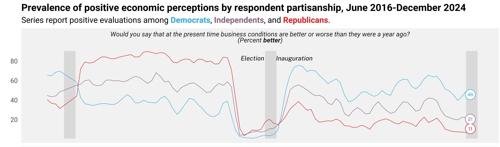
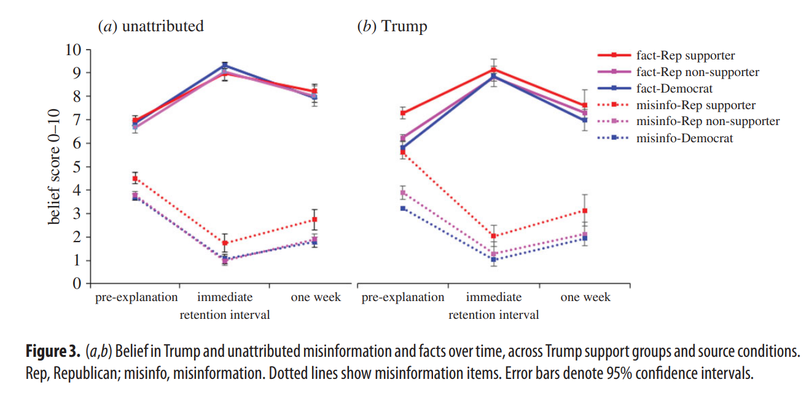
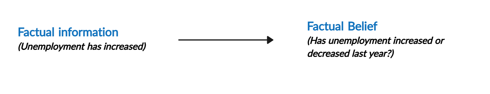
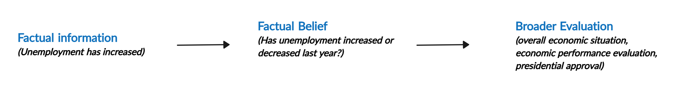
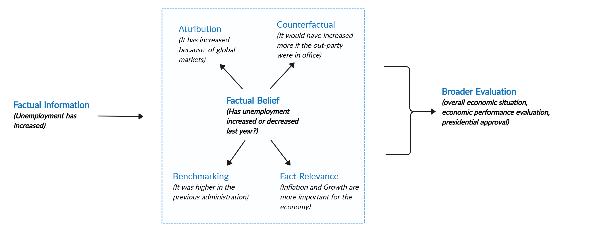

```{r setup, include=FALSE}
library(xaringanthemer)
library(kableExtra)
library(xaringan)
library(xaringanExtra)

style_duo_accent(primary_color = "#001A57",
                 secondary_color = "#708090",
                 text_font_family = "Droid Serif",
                 text_font_url = "https://fonts.googleapis.com/css?family=Droid+Serif:400,700,400italic",
                 header_font_google = google_font("Yanone Kaffeesatz"),
                 text_slide_number_color = "#000000")
knitr::opts_chunk$set(echo = FALSE)
options("kableExtra.html.bsTable" = T)

htmltools::tagList(
  xaringanExtra::use_clipboard(
    button_text = "<i class=\"fa fa-clipboard\"></i>",
    success_text = "<i class=\"fa fa-check\" style=\"color: #90BE6D\"></i>",
    error_text = "<i class=\"fa fa-times-circle\" style=\"color: #F94144\"></i>"
  ),
  rmarkdown::html_dependency_font_awesome()
)
use_xaringan_extra(c("tile_view", "animate_css", "tachyons"))
use_scribble()
use_extra_styles(
  hover_code_line = TRUE,         
  mute_unhighlighted_code = TRUE
  )  

```  
  
## Identity-Protective Cognition

Partisanship works as a 'perceptual screen through which the individual tends to see what is favorable to his partisan orientation' <span class="cita">(Campbell et al., 1960)</span>. 

Specifically, partisans: (1) Hold different factual beliefs <span class="cita">(Jerit and Barabas, 2012; Roush and Sood, 2020)</span>; (2) Evaluate  the quality of new evidence through a partisan lens <span class="cita">(Kahan, 2015; Guay and Johnston, 2022)</span>; (3) Interpret facts differently based on congruence with views <span class="cita">(Gaines et al., 2017; Bisgaard, 2019)</span>; (4) Interpret identical evidence differently depending on prior attitudes or identities <span class="cita">(Khanna and Sood, 2018; Guay and Johnston, 2022)</span>. 

  
<div style="text-align: center;">

</div>


---

## Pushback on Identity-Protective Cognition

(1) Observational equivalence between motivated reasoning and Bayesian updating <span class="cita">(Druckman & McGrath, 2019; Tappin, Pennycook, & Rand, 2021)</span>; (2) partisan gaps in factual beliefs are smaller than previously assumed <span class="cita">(Roush and Sood, 2020)</span>; (3) misperceptions are often held with less confidence than commonly thought <span class="cita">(Graham, 2024)</span>; (4) incentives further narrow gaps in factual beliefs <span class="cita">(Bullock et al., 2015; Pior et al., 2015)</span>; (5) Parallel belief updating between Democrats and Republicans when exposed to the same information <span class="cita">(Swire et al., 2017; Coppock 2023; Nyhan et al., 2020)</span>

 
<div style="text-align: center;">

</div>


---

## Belief Updating

<div style="display: flex; justify-content: center; align-items: center; height: 70%;">
  
</div>

---

## What are the Consequences of Belief Updating?

<div style="display: flex; justify-content: center; align-items: center; height: 70%;">
  
</div>


---

## Rationalization Strategies

<div style="display: flex; justify-content: center; align-items: center; height: 70%;">
  
</div>

